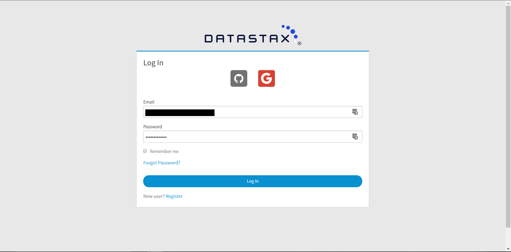
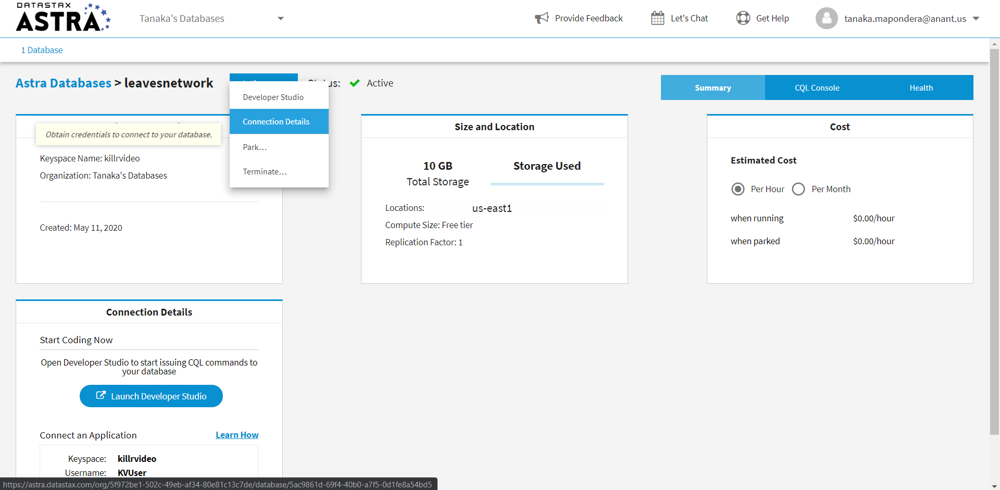
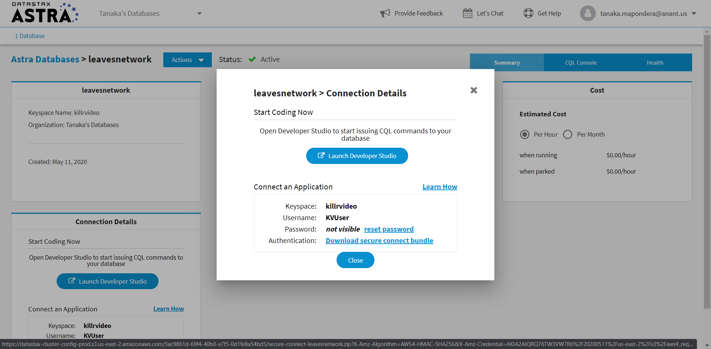
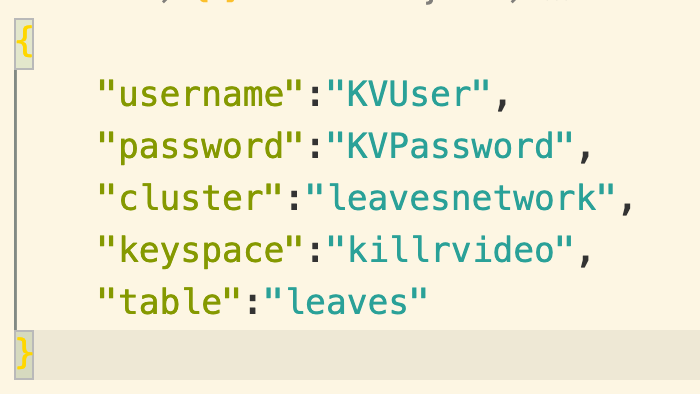

# Leaves.Astra 


Leaves on DataStax Astra™ with NoSQL, and Apache Cassandra™ in the cloud!

## Setup & Authorization
---- 

Before you start using our tools, you'll need to create an account on DataStax Astra:
```
https://auth.cloud.datastax.com
```
You'll then be directed to this screen where you fill in details to launch new Astra Database.



You can use the following details to complete your database
```
database name: leavesnetwork
keyspace name: killrvideo
username:KVUser
password:KVPassword
```



NOTE: Feel free to use your own naming conventions but keep in mind that you'll need to adjust the values in your credentials file later on.

The last step you'll need to do on Astra is to download your "secure-connection-details-zip". To do that, click on the actions button in the top left section of the screen then click on "Conection dEtails"



After, click on the link to download "secure connect bundle" and save the zip file to the **cassandra.api/astra.credentials** directory of this project. 

* Modify each field value in **leaves.astra/astra.credentials/UserCred.json** 



---

## Getting started

### For Local Deployment

```
git clone https://github.com/xingh/leaves.astra.git
cd leaves.astra/
```

### For Online/Cloud Deployment

[](https://gitpod.io/#https://github.com/xingh/leaves.astra.git)

---

### Data Migrator

- Click on the link below to run the "Data Migrator" which transfer data from our leaves API to your Astra Database.

[README](https://github.com/Anant/cassandra.api/blob/master/astra.import/README.md)

---

### APIs
---

#### NODE.JS

- Click on the link below if you wish to use our "NodeJS API" with with your Astra Database.

[README](https://github.com/Anant/cassandra.api/blob/master/astra.api/leaves.api.node/README.md)

#### PYTHON

- Click on the link below if you wish to use our "Python API" with your Astra Database.

[README](https://github.com/Anant/cassandra.api/blob/master/astra.api/leaves.api.python/README.md)

### API Reference Material

[Building REST API Blog PosT](https://blog.anant.us/building-a-rest-api-with-cassandra-on-datastax-astra-using-python-and-node/)

[Building REST API Webinar REcording](https://blog.anant.us/building-a-rest-api-with-cassandra-on-datastax-astra-using-python-and-node/)

---

### TESTING
--- 

- Click on the link below to run test against your API and your Astra Database.

[README](https://github.com/xingh/leaves.astra/blob/master/astra.api/leaves.api.tests/README.md)
