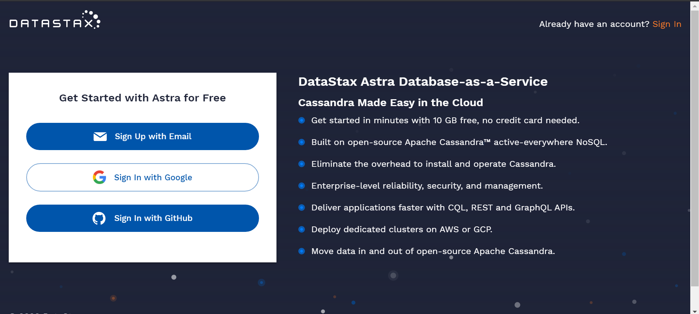
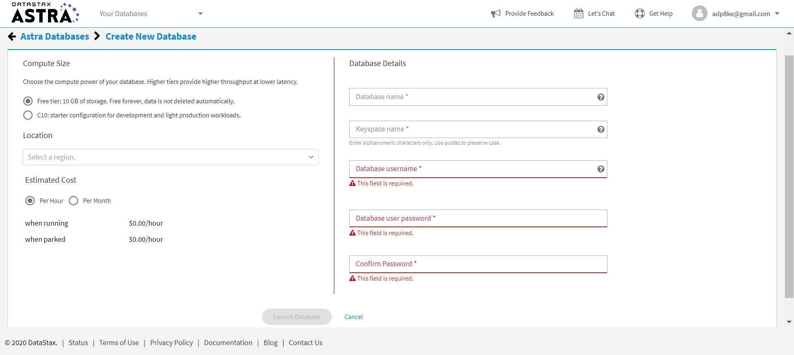
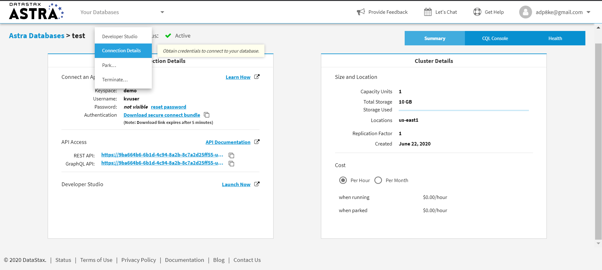
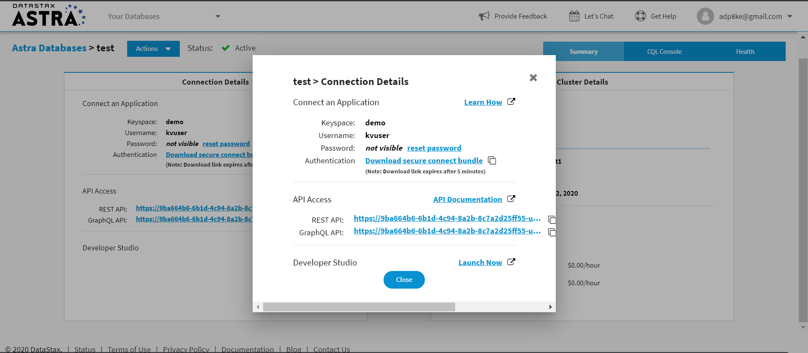

# Leaves on DataStax Astra™ with NoSQL, and Apache Cassandra™ in the cloud! 


[](https://gitpod.io/#https://github.com/anant/cassandra.api.git)

## Table of Contents

1. [Astra Setup & Configuring Credentials](#setup) 
2. [Getting Started](#Getting-Started)
	1. [Running Data Migrator](#Data-Migrator)
	2. [Node JS](#Node-js)
	3. [Python](#python)
	4. [Running Unit Tests](#testing)
	5. [Running Admin UI](#admin-ui)
  
---

## Setup


1. Before you start using our tools, you'll need to create an account on [DataStax Astra](https://astra.datastax.com/register)



2. You'll then be directed to this screen where you fill in details to launch new Astra Database.



***Avoid using "hyphens" or "underscores" in your database name***

3. Then, you'll need to do on Astra is to download your "secure-connection-details-zip". To do that, click on the actions button in the top left section of the screen then click on "Conection Details"



4. After, click on the link to "Download secure connect bundle" and save the zip file to the **cassandra.api/astra.credentials** directory of this project. 



5. ***Fill in the naming conventions you declared earlier, when you setup your database, in your (cassandra.api/astra.credentials/UserCred.json) file***
- The following is an example of what the UserCred.json would look like following the example in the screenshots above.

```
{ 
    "username":"kvuser", 
    "password":"kvpassword", 
    "cluster":"test", 
    "keyspace":"demo", 
    "table":"leaves"
}
```

The last value ``table`` wasn't declared before so you can do that here for the first time.

---

## Getting Started

***It's best to go through this project in the following order so you do not get confused.***


### First, run the data migrator to transfer data from our cassandra.api to your Astra Database.

#### [Data Migrator](https://github.com/Anant/cassandra.api/tree/master/astra.import)


### Second, setup an API so that you can communicate with your Astra database. We have 2 APIs for you to use:


#### [Node JS](https://github.com/Anant/cassandra.api/tree/master/astra.api/leaves.api.node)


#### [Python](https://github.com/Anant/cassandra.api/tree/master/astra.api/leaves.api.python)


### Next, run this set of unit tests against your API to confirm that it is working properly.

#### [Testing](https://github.com/Anant/cassandra.api/tree/master/astra.api/leaves.api.tests)


### Finally, we have Web Admin UI to visualize your Astra Database in Table Format

#### [Admin UI](https://github.com/Anant/cassandra.api/tree/master/astra.ui)


---
## Reference Material

[Cassandra.API Documentation Walkthrough](https://youtu.be/ZuIjoL60Ad4)

[Cassandra.API Blog Post: Part 1](https://blog.anant.us/setting-up-your-datastax-astra-instance-with-cassandra-api/)

[Cassandra.API Blog Post: Part 2](https://blog.anant.us/new-features-to-cassandra-api/)

[Building a REST API with DataStax Astra using Node & Python: Part 1](https://blog.anant.us/building-a-rest-api-with-cassandra-on-datastax-astra-using-python-and-node/)

[Building a REST API with DataStax Astra using Node & Python: Part 2](https://blog.anant.us/developer-workshop-building-a-rest-api-with-cassandra-using-python-and-node/)

[Cassandra.API Live Workshop w/DataStax](https://www.youtube.com/watch?v=kRYMwOl6Uo4&list=PL2g2h-wyI4SqcSXuShseNQnHMAWl0SF4q&index=2&t=0s)

[Cassandra.API Video Demo: Part 1](https://www.youtube.com/watch?v=O64pJa3eLqs)

[Cassandra.API Video demo: Part 2](https://www.youtube.com/watch?v=j2B_1_yv3CM&feature=youtu.be)
