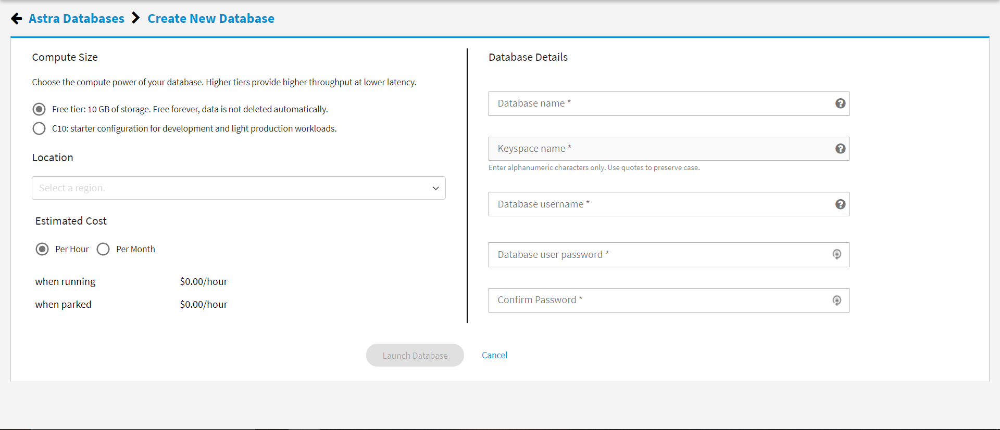

# Cassandra.API 

Leaves on DataStax Astra™ with NoSQL, and Apache Cassandra™ in the cloud!

So far we have 3 parts to this project:

1) Data Migrator - astra.import
2) Node or Python API Setup - astra.api
3) API Testing -astra.api/leaves.api.tests

***It's best to go through this project in that order so you do not get confused.***

---

## Setup & Authorization


Before you start using our tools, you'll need to create an account on DataStax Astra:
```
https://auth.cloud.datastax.com
```


You'll then be directed to this screen where you fill in details to launch new Astra Database.



You can use the following details to complete your database
```
database name: leavesnetwork
keyspace name: killrvideo
username:KVUser
password:KVPassword
```

***NOTE: Feel free to use your own naming conventions but keep in mind that you'll need to adjust the values in your credentials file later on.***

The last step you'll need to do on Astra is to download your "secure-connection-details-zip". To do that, click on the actions button in the top left section of the screen then click on "Conection Details"


After, click on the link to "Download secure connect bundle" and save the zip file to the **cassandra.api/astra.credentials** directory of this project. 


* Modify each field value in **leaves.astra/astra.credentials/UserCred.json** 


---

## Getting started

### For Local Deployment

```
git clone https://github.com/xingh/leaves.astra.git
cd leaves.astra/
```

### For Cloud Deployment

[](https://gitpod.io/#https://github.com/anant/cassandra.api.git)

---


### Data Migrator

- Transfer data from our leaves.api to your Astra Database.

- [Use the Data Migrator](https://github.com/Anant/cassandra.api/blob/master/astra.import/README.md)

---

### APIs

- We have 2 APIs you can use with Astra.

#### NODE.JS

- [Use NODE API with your Astra Database](https://github.com/Anant/cassandra.api/blob/master/astra.api/leaves.api.node/README.md)

#### PYTHON

- [Use Python API with your Astra Database](https://github.com/Anant/cassandra.api/blob/master/astra.api/leaves.api.python/README.md)

#### API Reference Material

[Building REST API Blog PosT](https://blog.anant.us/building-a-rest-api-with-cassandra-on-datastax-astra-using-python-and-node/)

[Building REST API Webinar REcording](https://blog.anant.us/building-a-rest-api-with-cassandra-on-datastax-astra-using-python-and-node/)

---

### TESTING

- We wrote some Unit Test to confirm that your APIs are working properly.

- [Test your API against your Astra Database.](https://github.com/anant/cassandra.api/blob/master/astra.api/leaves.api.tests/README.md)
