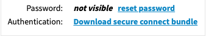

# Leaves.Astra 

Leaves on DataStax Astra™ with NoSQL, and Apache Cassandra™ in the cloud!

[](https://gitpod.io/#https://github.com/xingh/leaves.astra.git)

## Getting started

---- 

```sh
git clone https://github.com/xingh/leaves.astra.git
cd leaves.astra/
```

## Authorization
**IMPORTANT**

1. 
* On Astra, download your secure connect bundle:



* Add the `secure-connect-CLUSTER_NAME.zip` to **leaves.astra/astra.credentials/**

2. 
* Modify each field value in **leaves.astra/astra.credentials/UserCred.json** 


<br />

## RUN DATA MIGRATOR
- - - 

```
python3 astra.import/data/RESTToAstra.py
```
<br />

### APIs
---

#### NODE.JS

[README](https://github.com/xingh/leaves.astra/blob/master/astra.api/leaves.api.node/README.md)

#### PYTHON

[README](https://github.com/xingh/leaves.astra/blob/master/astra.api/leaves.api.python/README.md)

##### Response:
```
[...] // # of articles
```
<br />

### TESTING
--- 

[README](https://github.com/xingh/leaves.astra/blob/master/astra.api/leaves.api.tests/README.md)
