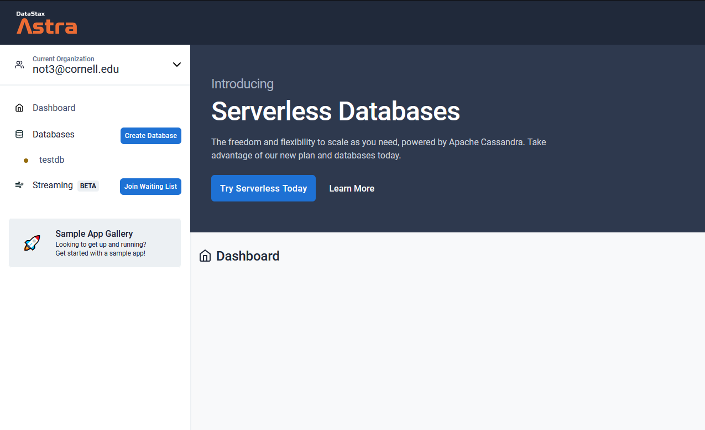
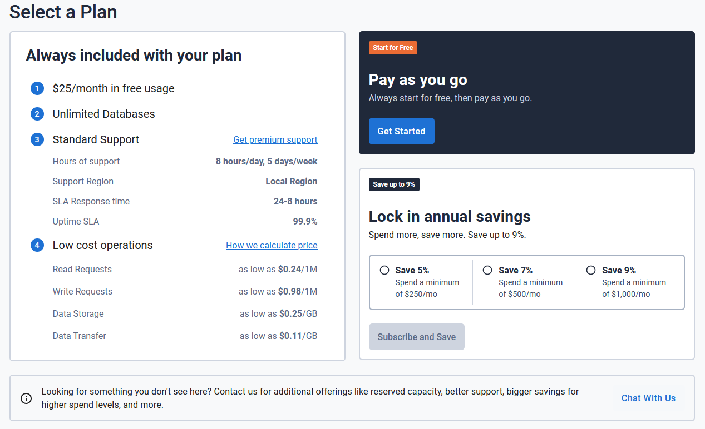
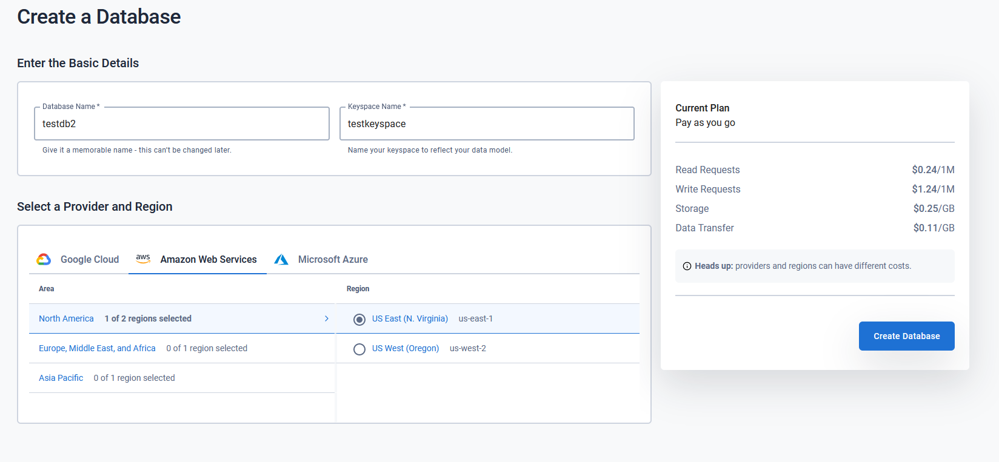
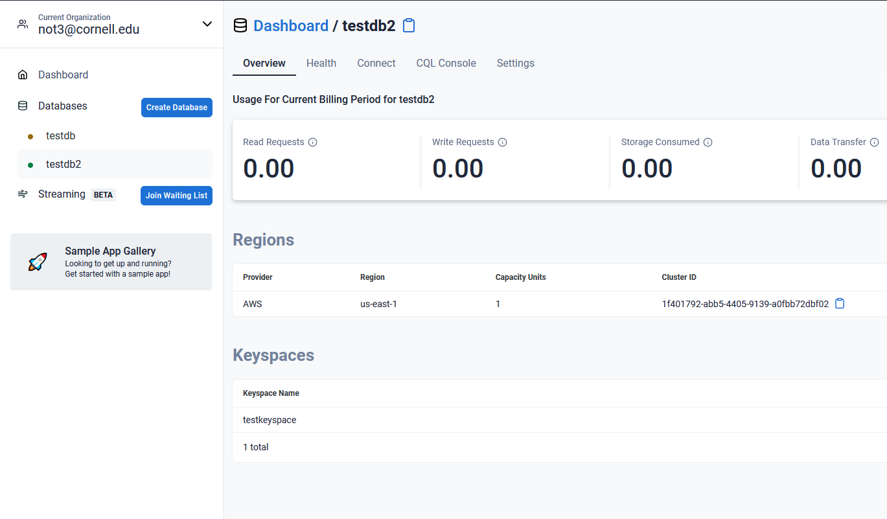

# Leaves on DataStax Astra™ with NoSQL, and Apache Cassandra™ in the cloud! 


[](https://gitpod.io/#https://github.com/anant/cassandra.api.git)

## Table of Contents

1. [Astra Setup & Configuring Credentials](#setup) 
2. [Getting Started](#Getting-Started)
	1. [Running Data Migrator](#Data-Migrator)
	2. [Node JS](#Node-js)
	3. [Python](#python)
	4. [Running Unit Tests](#testing)
	5. [Running Admin UI](#admin-ui)
  
---

## Setup

### 1.1 Create Account

- Before you start using our tools, you'll need to create an account on [DataStax Astra](https://dtsx.io/workshop)


### 1.2 Create New Database

- You'll then be directed to the home page. Locate the `Create Database` button on the left side: 



- On the following screen, press the `Get Started` button underneath "Pay as you go": 



- Enter a database name and keyspace name. Select any of the providers at the bottom and select the region closest to you. Then press `Create Database`



- Now wait a few minutes for the database to spin up, and click on the name of the database on the left side of the screen. Expected result: 



Database is ready, notice how the status changed from `pending` to `Active` and now you now have the **connect** button enabled.*


### 1.3 Finding Secure Connect Bundle

- Get your secure connect bundle.
- To do so, access your connections panel by clicking the `connect` button.


- On the connect screen pick `drivers`


### 1.4 Download Secure Connect Bundle

- Finally, click the Download Secure Connect Bundle button to download the zip. Once saved, move the zip into the `cassandra.api/astra.credentials` directory of this project.


### 1.5 Configure Cassandra.API Connection

- Fill in the naming conventions you declared earlier, when you setup your database, in your ***(cassandra.api/astra.credentials/UserCred.json) file***
- The following is an example of that the UserCred.json file would look like using the credentials used for configuring the Astra instance.

```
{ 
    "username":"kvuser", 
    "password":"kvpassword", 
    "cluster":"test", 
    "keyspace":"demo", 
    "table":"leaves"
}
```

The last value ``table`` wasn't declared before so you can do that here for the first time.

---

## Getting Started

***It's best to go through this project in the following order so you do not get confused.***


### 2.1 Run the data migrator to transfer data from our cassandra.api to your Astra Database.

#### [Data Migrator](https://github.com/Anant/cassandra.api/tree/master/astra.import)


### 2.2 Setup an API so that you can communicate with your Astra database. We have 2 APIs for you to use:


#### [Node JS](https://github.com/Anant/cassandra.api/tree/master/astra.api/leaves.api.node)


#### [Python](https://github.com/Anant/cassandra.api/tree/master/astra.api/leaves.api.python)


### 2.3 Run this set of unit tests against your API to confirm that it is working properly.

#### [Testing](https://github.com/Anant/cassandra.api/tree/master/astra.api/leaves.api.tests)


### 2.4 Launch Web Admin UI to visualize your Astra Database in Table Format

#### [Admin UI](https://github.com/Anant/cassandra.api/tree/master/astra.ui)


---
## Reference Material

[Cassandra.API Documentation Walkthrough](https://youtu.be/ZuIjoL60Ad4)

[Cassandra.API Blog Post: Part 1](https://blog.anant.us/setting-up-your-datastax-astra-instance-with-cassandra-api/)

[Cassandra.API Blog Post: Part 2](https://blog.anant.us/new-features-to-cassandra-api/)

[Building a REST API with DataStax Astra using Node & Python: Part 1](https://blog.anant.us/building-a-rest-api-with-cassandra-on-datastax-astra-using-python-and-node/)

[Building a REST API with DataStax Astra using Node & Python: Part 2](https://blog.anant.us/developer-workshop-building-a-rest-api-with-cassandra-using-python-and-node/)

[Cassandra.API Live Workshop w/DataStax](https://www.youtube.com/watch?v=kRYMwOl6Uo4&list=PL2g2h-wyI4SqcSXuShseNQnHMAWl0SF4q&index=2&t=0s)

[Cassandra.API Video Demo: Part 1](https://www.youtube.com/watch?v=O64pJa3eLqs)

[Cassandra.API Video demo: Part 2](https://www.youtube.com/watch?v=j2B_1_yv3CM&feature=youtu.be)
