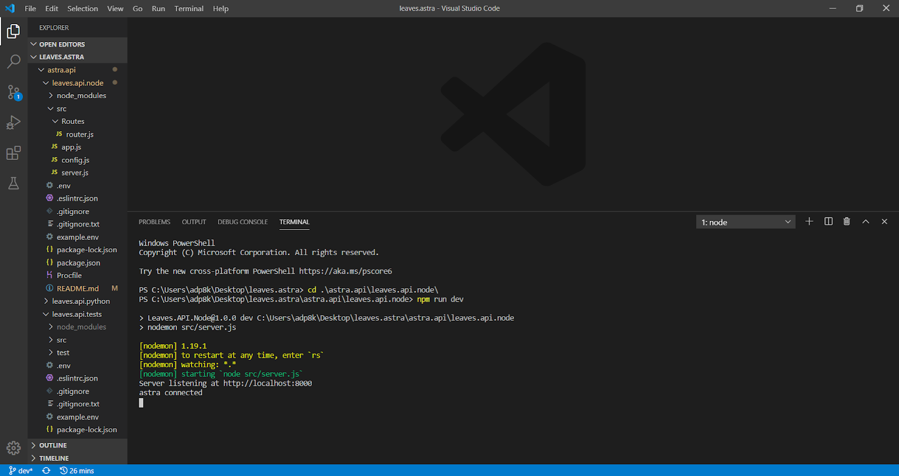
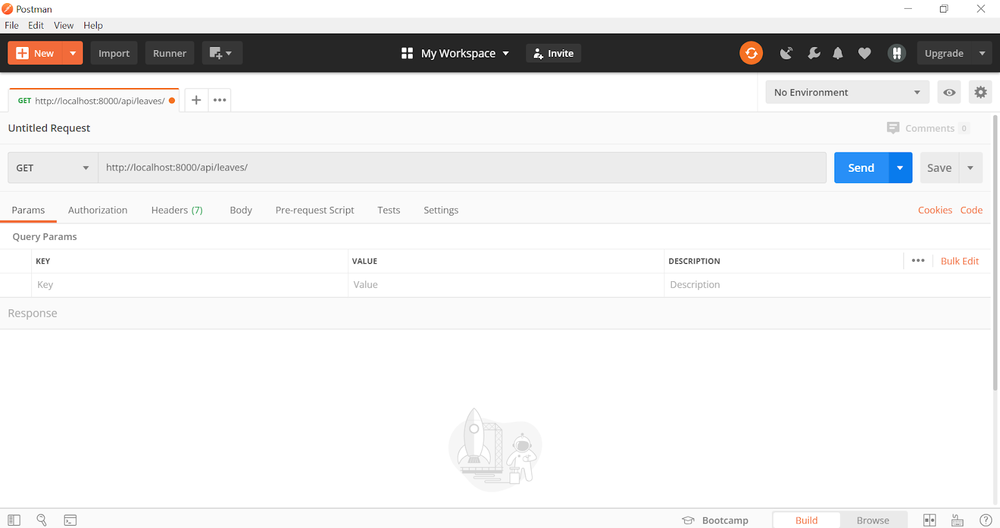
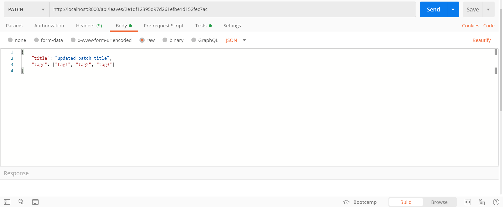
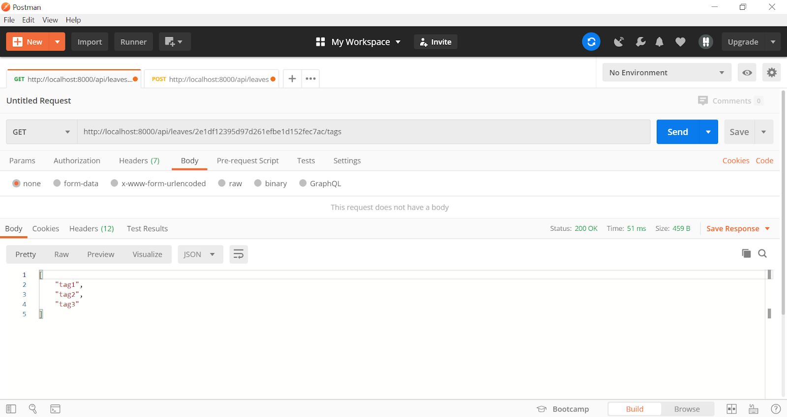
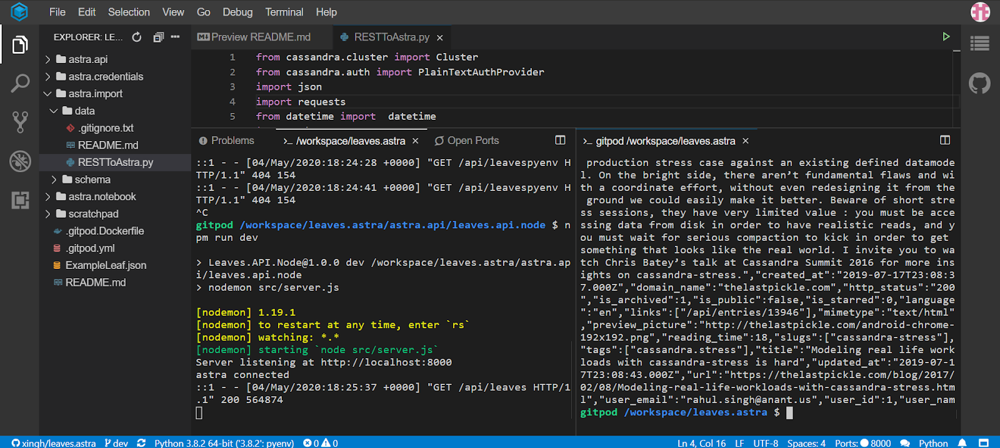
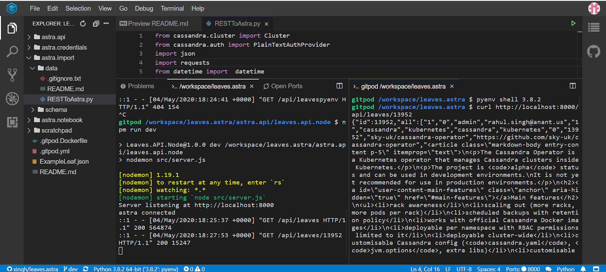

# Node REST API

These instructions will get your Node REST API using Astra up and running locally and on the cloud.
Before using this API, run the data importer first so that you have data in your database.

## Getting Started

### NOTE: Endpoints (Ongoing/Subject to change)

* `/api/leaves`
    * `GET` -> (**WORKING + TESTED**) Returns items from the KEYSPACE.leaves table
    * `POST` -> (**WORKING + TESTED**) Creates a new item in the KEYSPACE.leaves table

* `/api/leaves/:id`
    * `GET` -> (**WORKING + TESTED**) Returns single item based on id parameter from KEYSPACE.leaves table
    * `PATCH` -> (**WORKING AND TESTED**) Updates an item in KEYSPACE.leaves table based on id parameter and request body
    * `Delete` -> (**WORKING + TESTED**) Deletes an item in KEYSPACE.leaves table based on id parameter

* `/api/leaves/:id/tags`
    * `GET` -> (**WORKING + TESTED**) Returns all tags associated with item id from KEYSPACE.leaves table
    * `POST` -> (**WORKING + TESTED**) Adds tags to item associated with id in KEYSPACE.leaves table
    * `Delete` -> (**WORKING + TESTED**) Deletes tags and slugs and removes both from all in item associated with id in KEYSPACE.leaves table

---

### Running the API Locally 

You need to insert the secure connect bundle and credentials from Astra in `/astra.credentials` and `/astra.credentials/UserCred.json`, respectively. You will also need to run the data migrator from `/astra.import/RESTToAstra.py` to seed the database before we begin making requests to the API. Set the rows = 100 on line 32 and run the migrator.

Run the following commands:

```
npm install
npm run dev
```

You sould see the following screen if eveyrthing worked succesfully.



We will begin by testing the endpoints with Postman.

To get the collection of endpoints, copy this link: <https://www.getpostman.com/collections/fec7e958c0140321191a>

To use the link above, we will need to open Postman and click the import button, which will open this modal as seen below.


Click on the "link" tab, insert the link you copied, and hit "continue".

After confirming the import, you should see the collection named Cassandra.API with two folders: Tests and Templates.


The test folder contains the endpoints used in the walkthrough below, while the template folder contains templated endpoints with example paths and request bodies. Example responses can be seen by clicking on an endpoint and then clicking the example tab in the right hand corner.


**NOTE: If using Gitpod rather than Local development, you will need to change the base URLs in the test endpoints, as well as, the template endpoints. Currently, the template and test endpoints are using `http://localhost:8000`. If you choose to use this Postman collection while running the API on Gitpod, you will need to run your API on Gitpod, hit "Make Public", and "Open Browser" as seen below. Then, take the Gitpod URL from the browser and replace the `http://localhost:8000` with your Gitpod URL e.g. `https://8000-e39a02a0-2021-4f47-80c5-02013a0be91c.ws-us02.gitpod.io/` in the Postman collection as seen below. Once all URLs have been replaced, you can continue with the instructions below.**


If you would like to run the test endpoints in the test folder, click on the play button as seen below.


Then click on the run button and a new window should appear as seen below.


We want to deselect all items first by clicking the "Deselect All" option in the right hand corner because we do not want to run the template endpoints. Once we deselect all, re-select the endpoints with the "TEST" preface as seen below.


After doing so, we can now scroll down and run the tests by clicking on "Run Cassandra.API". The results should be as so.


At this point, you can either play around with the endpoints in the "Tests" folder as they match the endpoints used in the walkthrough below, or you can use the template endpoints in the "Templates" folder to follow along with the walkthrough. 

#### Postman Walkthrough

First, using Postman, we will make a GET request to `http://localhost:8000//api/leaves/` to get an array of all items in the database.



Upon hitting send, then results will be returned in a JSON format. The response status can be seen in the right hand corner with time taken and the size of the response:


To make a POST request to `http://localhost:8000/api/leaves/`, we will need a request body with a key value of {"url" : ""}.


We will get a JSON response of the new item.


To make a request to `https://localhost:8000/api/leaves/:id`, we can use the first returned response from the last GET request and insert that item’s `id` as a parameter:


After hitting send, the response should return only one item, the one associated with that specific `id`. Notice the size of the response is much smaller than when running the prior:


To make a DELETE request via `https://localhost:8000/api/leaves/:id`, the same steps are followed as before. Take a specific item’s `id`, and insert that into the URL, but change the GET to a DELETE:


After sending the request, you should see a response code of 200 and a JSON with a message:


To handle errors when trying to delete an item that doesn’t exist, re-run the DELETE request that was just run and you will see another JSON message, but with a different response status code:


To make a PATCH request via `https://localhost:8000/api/leaves/:id`, we will need a request body of any of the following key value pairs: title, tags, is_archived, is_starred, content, language, preview_picture, is_public, and url. We will send a request body of title and tags.



The JSON response will be shown below.


To get all tags associated with an item, we will make a GET request to `http://localhost:8000/api/leaves/:id/tags`. These will be the tags that we updated from the PATCH request before.



To add tags to an associated item, we will need to make a POST request to `http://localhost:8000/api/leaves/:id/tags` and will require a request body as shown below. 


After hitting send, we will see the existing tags with the new tags we sent with the POST request.


To delete tags associated with an item, we will make a DELETE request to `http://localhost:8000/api/leaves/:id/tags` and the response will be shown below.


Going back to the code terminal, you can see a list of requests that were made and the response codes associated with those requests:


---

### Running the API on Gitpod 

[](https://gitpod.io/#https://github.com/anant/cassandra.api.git)

cassandra.api/astra.api/leaves.api.node

Now to do the same thing with cURL, we will use the repository on Gitpod to showcase that the code works there and the same information can be returned. To start a new workspace, go to `gitpod.io#<Insert url to github repo>`. After the Gitpod finishes setting up, you need to insert the secure connect bundle and credentials from Astra in `/astra.credentials` and `/astra.credentials/UserCred.json`, respectively. 

Once that is done, run the following commands:

```
npm install
npm run dev
```

You sould see the following screen if eveyrthing worked succesfully.


Once started, an alert will appear like the image below.


Add `/api/leaves` to Gitpod url to view the API.

You can click make public and we will get ready to make cURL requests. To do so, we will need to open a new terminal, while keeping the one running the server open. You will also need to run the data migrator from `/astra.import/RESTToAstra.py` to seed the database before we begin making requests to the API. Set the rows = 100 on line 32 and run the migrator. To make the cURL request to get all, we will run `curl http://localhost:8000/api/leaves/`.


Running that will return the result in the terminal, so we will show the end of the last result as the beginning of the result set won’t be able to be seen.



To make a POST request to `http://localhost:8000/api/leaves/`. we will run `curl -X POST -H 'Content-type: application/json' --data '{"url": "https://github.com/Anant/cassandra.api"}' http://localhost:8000/api/leaves`


To get by `id`: run `curl http://localhost:8000/api/leaves/:id`. We will use the same `id` we did for Postman.



As you can see, the returned result is associated with the item with the `id`, and the response code can be seen on the left terminal that is running the server. 

To make a DELETE request, we can do use the same id, but add a “DELETE” to the curl: `curl -X “DELETE” http://localhost:8000/api/leaves/13952`


And to replicate the 404 error and JSON message, we can run that request again:


To make a PATCH request using curl to `http://localhost:8000/api/leaves/:id` to update the title and tags of the item we created with POST, we will run `curl -X PATCH -H 'Content-type: application/json' --data '{"title": "curl patch title","tags": ["tag1", "tag2", "tag3"]}' http://localhost:8000/api/leaves/2e1df12395d97d261efbe1d152fec7ac`


To get all tags associated with an item, we will make a GET request to `http://localhost:8000/api/leaves/:id/tags` with the id used in the PATCH request. These will be the tags that we updated from the PATCH request before. Run `curl http://localhost:8000/api/leaves/2e1df12395d97d261efbe1d152fec7ac/tags`


To add tags to an associated item, we will need to make a POST request to `http://localhost:8000/api/leaves/:id/tags`. Run `curl -X POST -H 'Content-type: application/json' --data '{"tags": ["tag4", "tag5", "tag6"]}' http://localhost:8000/api/leaves/2e1df12395d97d261efbe1d152fec7ac/tags`. After hitting send, we will see the existing tags with the new tags we sent with the POST request. 


To delete tags associated with an item, we will make a DELETE request to `http://localhost:8000/api/leaves/:id/tags`. We will run `curl -X DELETE http://localhost:8000/api/leaves/2e1df12395d97d261efbe1d152fec7ac/tags`


## Built With

* [NodeJS](https://nodejs.org/en/) - Framework Used
* [CQLSH](https://docs.datastax.com/en/astra/aws/doc/dscloud/astra/dscloudConnectcqlshConsole.html) - Connecting to Astra databases using CQLSH

## Contributing

## Versioning

## Authors
* **Arpan Patel** - *Initial work*

See also the list of [contributors](https://github.com/your/project/contributors) who participated in this project.