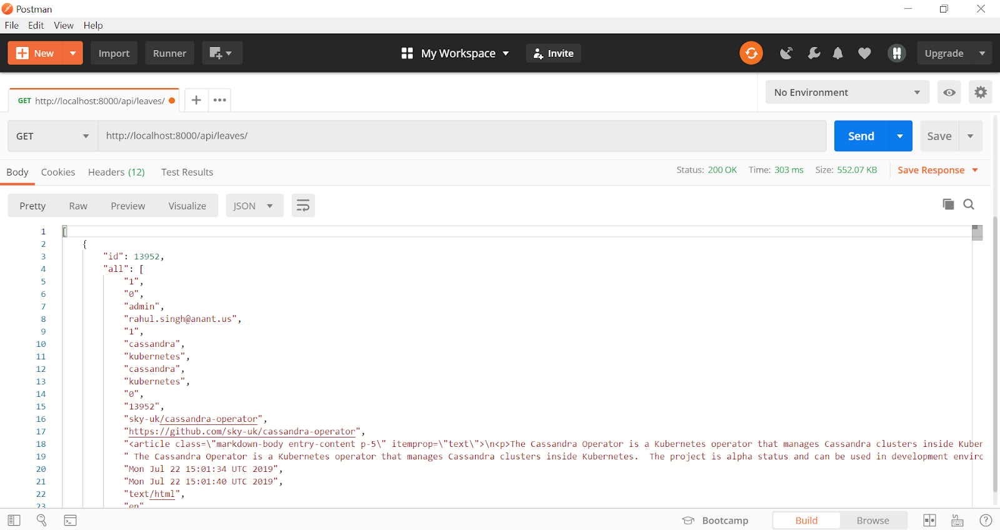
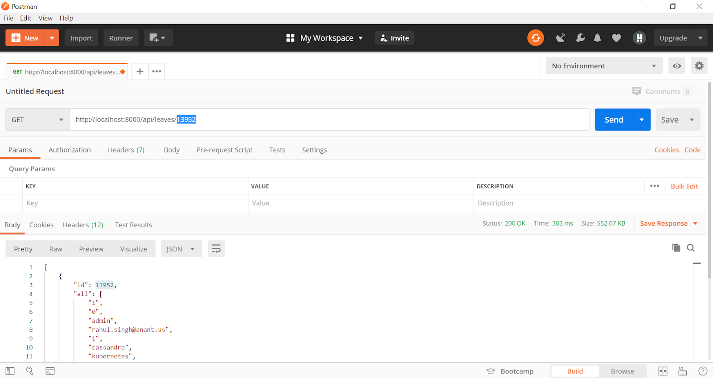
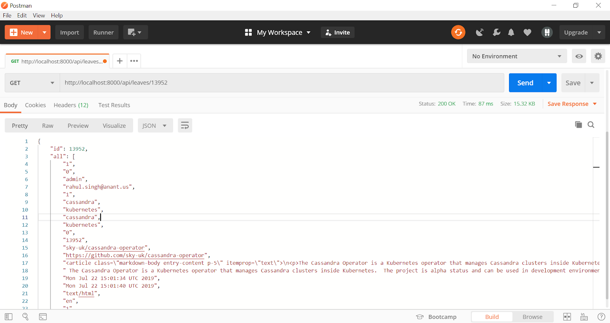
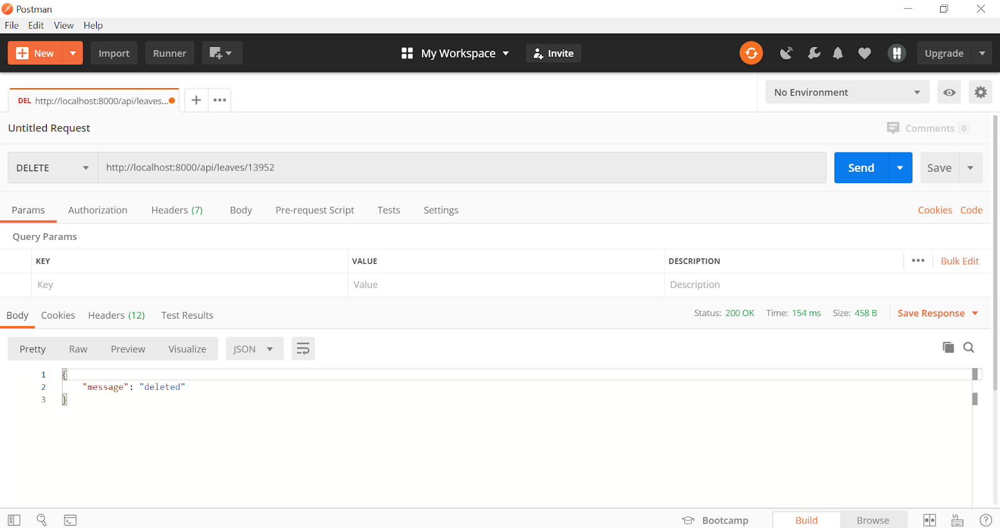
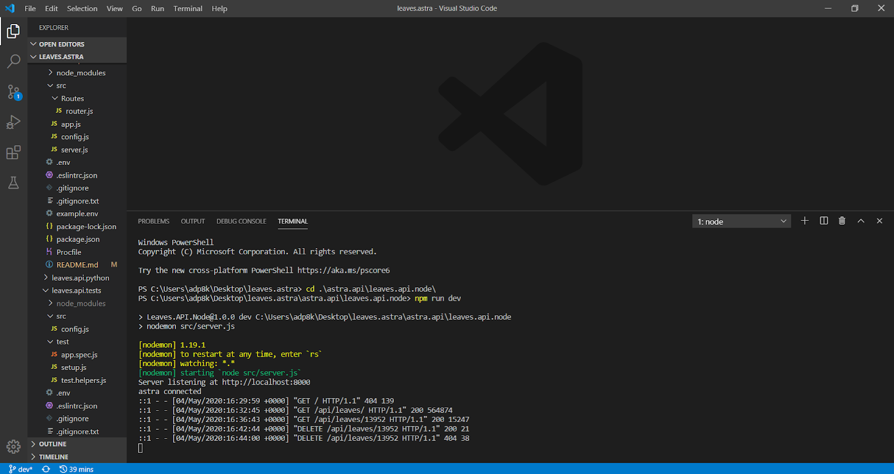
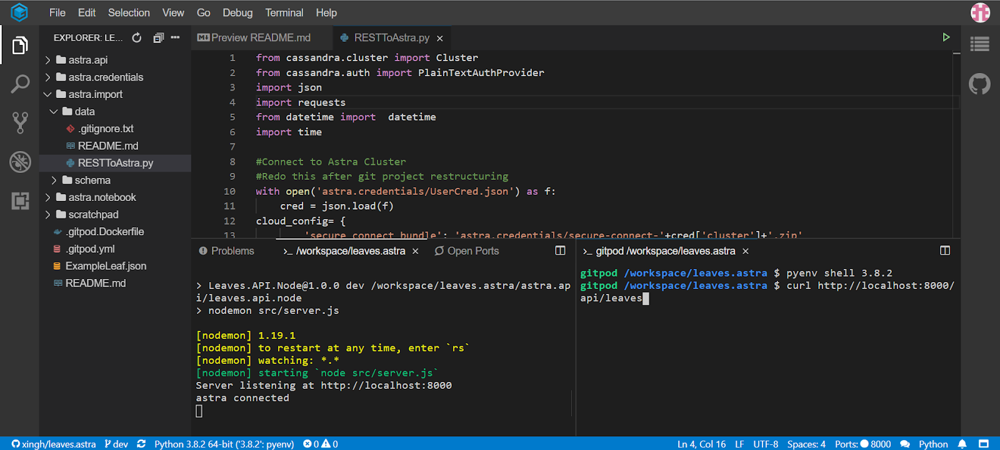
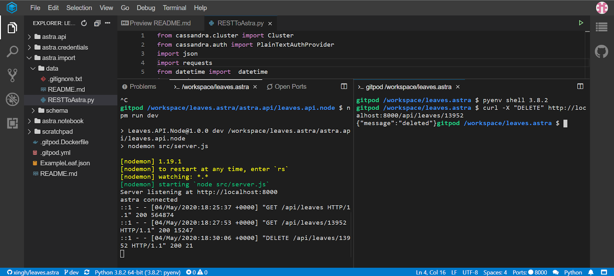

# Node REST API

These instructions will get your Node REST API using Astra up and running locally and on the cloud.
Before using this API, run the data importer first so that you have data in your database.

## Getting Started

### NOTE: Endpoints (Ongoing/Subject to change)

* `/api/leaves`
    * `GET` -> (**WORKING + TESTED**) Returns items from the KEYSPACE.leaves table
    * `POST` -> (**TBD AND UNTESTED TO LEAVES DB**) Creates a new item in the KEYSPACE.leaves table

* `/api/leaves/:id`
    * `GET` -> (**WORKING + TESTED**) Returns single item based on id parameter from KEYSPACE.leaves table
    * `PATCH` -> (**TBD AND UNTESTED TO LEAVES DB**) Updates an item in KEYSPACE.leaves table based on id parameter and request body
    * `Delete` -> (**WORKING + TESTED**) Deletes an item in KEYSPACE.leaves table based on id parameter

---

### Running the API Locally 

You need to insert the secure connect bundle and credentials from Astra in /astra.credentials and /astra.credentials/UserCred.json, respectively. You will also need to run the data migrator from /astra.import/RESTToAstra.py to seed the database before we begin making requests to the API.

Run the following commands:

```
npm install
npm run dev
```

You sould see the following screen if eveyrthing worked succesfully.


Then navigate to`localhost:8000/api/leaves`

To make a request to `http://localhost:8000/api/leaves/` we will use Postman and cURL. First, using Postman, we will make a GET request to `http://localhost:8000//api/leaves/` to get an array of all items in the database.


Upon hitting send, then results will be returned in a JSON format. The response status can be seen in the right hand corner with time taken and the size of the response:



To make a request to `https://localhost:8000/api/leaves/:id`, we can use the first returned response from the last GET request and insert that item’s `id` as a parameter:



After hitting send, the response should return only one item, the one associated with that specific `id`. Notice the size of the response is much smaller than when running the prior:



To make a delete request via `https://localhost:8000/api/leaves/:id`, the same steps are followed as before. Take a specific item’s `id`, and insert that into the URL, but change the GET to a DELETE:


After sending the request, you should see a response code of 200 and a JSON with a message:



To handle errors when trying to delete an item that doesn’t exist, re-run the DELETE request that was just run and you will see another JSON message, but with a different response status code:


Going back to the code terminal, you can see a list of requests that were made and the response codes associated with those requests:



---

### Running the API on Gitpod 

[](https://gitpod.io/#https://github.com/anant/cassandra.api.git)

cassandra.api/astra.api/leaves.api.node

Now to do the same thing with cURL, we will use the repository on Gitpod to showcase that the code works there and the same information can be returned. To start a new workspace, go to `gitpod.io#<Insert url to github repo>`. After the Gitpod finishes setting up, you need to insert the secure connect bundle and credentials from Astra in `/astra.credentials` and `/astra.credentials/UserCred.json`, respectively. 

Once that is done, run the following commands:

```
npm install
npm run dev
```

You sould see the following screen if eveyrthing worked succesfully.


Once started, an alert will appear like the image below.


Add `/api/leaves` to Gitpod url to view the API.

You can click make public and we will get ready to make cURL requests. To do so, we will need to open a new terminal, while keeping the one running the server open. You will also need to run the data migrator from `/astra.import/RESTToAstra.py` to seed the database before we begin making requests to the API To make the cURL request to get all, we will run `curl http://localhost:8000/api/leaves/`.



Running that will return the result in the terminal, so we will show the end of the last result as the beginning of the result set won’t be able to be seen.


To do the same with cURL and getting by `id`: run `curl http://localhost:8000/api/leaves/:id`. We will use the same `id` we did for Postman.


As you can see, the returned result is associated with the item with the `id` of 13952, and the response code can be seen on the left terminal that is running the server. 

To make a DELETE request, we can do use the same id, but add a “DELETE” to the curl: `curl -X “DELETE” http://localhost:8000/api/leaves/13952`



And to replicate the 404 error and JSON message, we can run that request again:


## Built With

* [NodeJS](https://nodejs.org/en/) - Framework Used
* [CQLSH](https://docs.datastax.com/en/astra/aws/doc/dscloud/astra/dscloudConnectcqlshConsole.html) - Connecting to Astra databases using CQLSH

## Contributing

## Versioning

## Authors
* **Arpan Patel** - *Initial work*

See also the list of [contributors](https://github.com/your/project/contributors) who participated in this project.