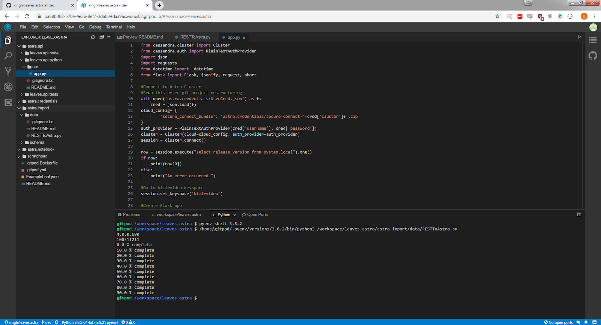

# Leaves.Astra Api (Python)

Python REST API using DataStax Astra with NoSQL, and Apache Cassandra™ in the cloud!

## Getting Started 

These instructions will get you a copy of the project up and running on your local machine for development and testing purposes. For deployment to Gitpod: 

### Prerequisites

- Python 2.7.17 or Python 3
- Python cassandra-driver
- Python requests
- Python flask

```sh
pip install cassandra-driver
pip install requests
pip install flask
```
OR 

```sh
pip install -r requirements.txt
```

### Setup (Locally)

- Create your database on DataStax Astra (Be sure to remmeber your keyspace name, username and password as those will be useful later on)
- Clone this repo
- Download the connection-details zip file from your Astra dashboard and place it in the "astra.credentials" folder.
- Add your credentials to the UserCred.json file in "leaves.astra/astra.credentials/" using the credentials you use to log in to the cql shell within astra as your username and password, and the name of your astra database under cluster
- Depending on the setup of your local machine's PATH, enviroment variable, you may need to edit lines 10, 13, 27 to inlcude the full paths for each file/folder the program is looking for.

```sh
line 10: with open('../../astra.credentials/UserCred.json') as f:
line 13: 'secure_connect_bundle': '../../astra.credentials/secure-connect-'+cred['cluster']+'.zip'
line 27: f = open('../../astra.import/AstraTableDef')
```
- Make sure to run the importer first so that you have data in your database.

## Running the Program (Locally)

Run the script with the following command:
```sh
python app.py
```

Navigate to `localhost:8000/api/leaves` to view all of the data in your astra database table.

Navigate to `localhost:8000/api/leaves/(id)` to view a single row from your table with the proper id.

## Running the program on Gitpod

[](https://gitpod.io/#https://github.com/anant/cassandra.api.git)

Use the sidebar to navigate to astra.api/leaves.api.python/src and open app.py



Hit the run button in the upper left or type ‘python3 astra.api/leaves.api.python/src/app.py’ into the terminal and hit enter. A popup will open in the lower right, telling you about a service on port 80.


Press the make public button


Press the open browser button. This will open a new tab and navigate to a 404 page.


Add /api/leaves to the end of that url and navigate to that page. It should contain a list of all of the rows put into your astra table via the data importer. During this step grab the id of at least one entry. (in this case the id is 13952)


Add that id to then end of the url, so that it looks like this [gitpod generated url]/api/leaves/[chosen id] in this case /api/leaves/13952 and navigate to the new url. This will show an individual entry from your astra database.


## Built With

* [Python](https://www.python.org/) - Language & Compiler Used
* [CQLSH](https://docs.datastax.com/en/astra/aws/doc/dscloud/astra/dscloudConnectcqlshConsole.html) - Connecting to Astra databases using CQLSH

## Contributing

## Versioning

## Authors
* **Obi** - *Initial work*


See also the list of [contributors](https://github.com/your/project/contributors) who participated in this project.
