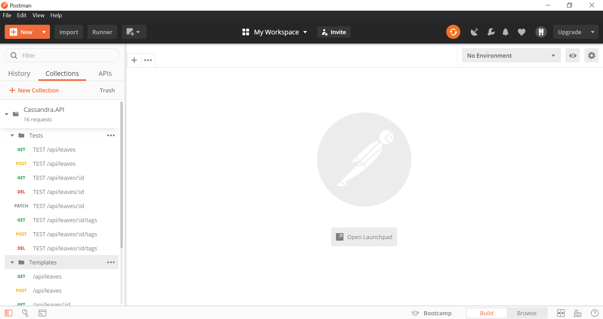
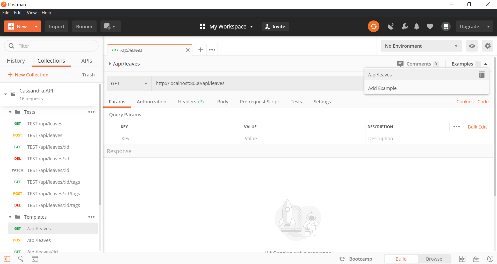
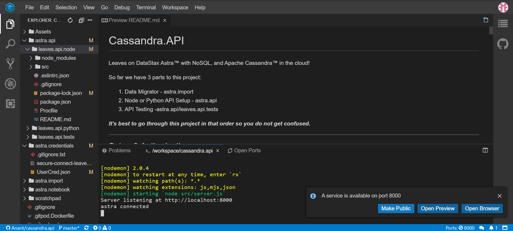
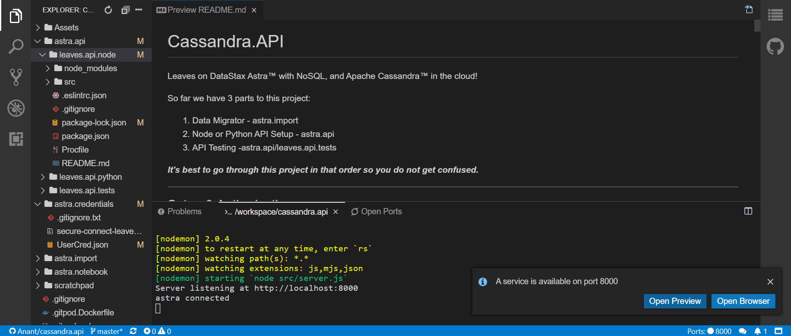
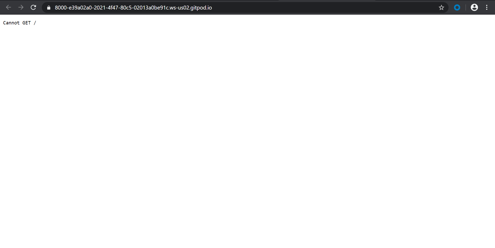
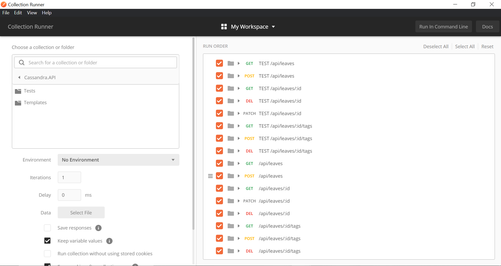
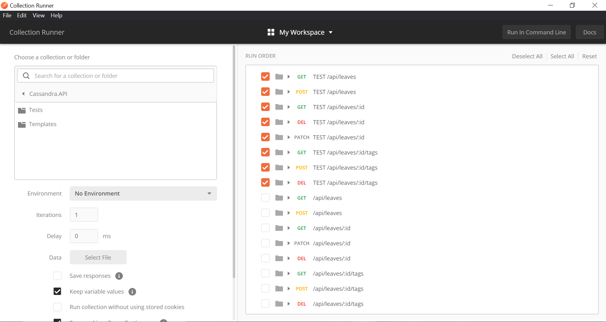
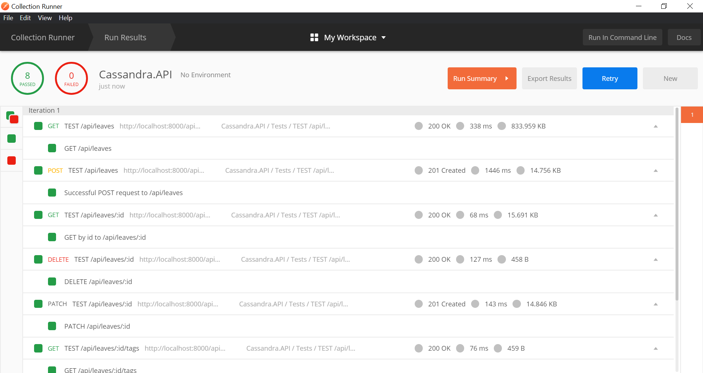

# Python REST API

## Getting Started 

These instructions will get your Python REST API using Astra up and running locally and on the cloud.
Before using this API, run the data importer first so that you have data in your database.

### Prerequisites

- Python 2.7.17 or Python 3
- Python cassandra-driver
- Python requests
- Python flask

**2.3.1** Run the following command:

```sh
pip install -r requirements.txt
```

### Setup for Both Local and Cloud Deployment

- Before reaching this step you should have created your Astra account and you should have already added your connection details to the "astra.credentials" directory. If not, please go back to the root directory and follow the instructions detailed in the readme there.
- You also need to add your credentials to the UserCred.json file in "cassandra.api/astra.credentials/" directory. Right now it has the example naming conventions that are stated in the main readme so if you used different conventions be sure to change those.
- Depending on the setup of your local machine's PATH, enviroment variable, you may need to edit lines 10, 13, 27 to inlcude the full paths for each file/folder the program is looking for.

```sh
line 71: with open('../../astra.credentials/UserCred.json') as f:
line 74: 'secure_connect_bundle': '../../astra.credentials/secure-connect-'+cred['cluster']+'.zip'
```

---

## Running the API Locally

**2.3.2** Run the script with the following command:
```sh
python3 app.py
```

Navigate to `localhost:8000/api/leaves` to view all of the data in your astra database table.

Navigate to `localhost:8000/api/leaves/(id)` to view a single row from your table with the proper id.

---

## Running the API on Gitpod

**2.3.3** [](https://gitpod.io/#https://github.com/anant/cassandra.api.git)

Use the sidebar to navigate to `astra.api/leaves.api.python/src` and open app.py


**2.3.4** Hit the run button in the upper left or type `python3 astra.api/leaves.api.python/src/app.py` into the terminal and hit enter. A popup will open in the lower right, telling you about a service on port 80.


Press the make public button


Press the open browser button. This will open a new tab and navigate to a 404 page.


**2.3.5** Add `/api/leaves` to the end of that url and navigate to that page. It should contain a list of all of the rows put into your astra table via the data importer. During this step grab the id of at least one entry. (in this case the id is 13952)


**2.3.6** Add that id to then end of the url, so that it looks like this `[gitpod generated url]/api/leaves/[chosen id]` in this case `/api/leaves/13952` and navigate to the new url. This will show an individual entry from your astra database.


## Usage / Testing via Postman

**2.3.7**To get the Postman collection of endpoints, copy this link: <https://www.getpostman.com/collections/fec7e958c0140321191a>

**2.3.8** To use the link above, we will need to open Postman and click the import button, which will open this modal as seen below.


Click on the "link" tab, insert the link you copied, and hit "continue".

After confirming the import, you should see the collection named Cassandra.API with two folders: Tests and Templates.



The test folder contains the endpoints used in the walkthrough below, while the template folder contains templated endpoints with example paths and request bodies. Example responses can be seen by clicking on an endpoint and then clicking the example tab in the right hand corner.



**NOTE: If using Gitpod rather than Local development, you will need to change the base URLs in the test endpoints, as well as, the template endpoints. Currently, the template and test endpoints are using `http://localhost:8000`. If you choose to use this Postman collection while running the API on Gitpod, you will need to run your API on Gitpod, hit "Make Public", and "Open Browser" as seen below. Then, take the Gitpod URL from the browser and replace the `http://localhost:8000` with your Gitpod URL e.g. `https://8000-e39a02a0-2021-4f47-80c5-02013a0be91c.ws-us02.gitpod.io/` in the Postman collection as seen below. Once all URLs have been replaced, you can continue with the instructions below.**








**2.3.9** If you would like to run the test endpoints in the test folder, click on the play button as seen below.


Then click on the run button and a new window should appear as seen below.



We want to deselect all items first by clicking the "Deselect All" option in the right hand corner because we do not want to run the template endpoints. Once we deselect all, re-select the endpoints with the "TEST" preface as seen below.



After doing so, we can now scroll down and run the tests by clicking on "Run Cassandra.API". The results should be as so.



At this point, you can either play around with the endpoints in the "Tests" folder, or you can use the template endpoints in the "Templates" folder to follow along with the walkthrough. 

### Postman Walkthrough

**2.3.10** Grab your gitpod-given url add `/api/leaves` to the end and paste into the url space in postman. Hit the send button. Your response should be a list of all of the entries in your astra table. Grab an id value from one of the entries to use in later steps.


Test getting single entries by adding the id you got to the end of the url and hit send. This should return that single entry and no others. If you try with an id that is not in the table, you will get a 404 page.


The delete postman request is similar to the one that gets a single entry but the parameter to the left of the url is changed to delete


When run, you will get a 404 page returned.  The get for that id will also start to return 404 pages.


**2.3.11** In order to post new entries, create a POST request with the header, Content-Type application/json and the body of a json entry with the key url and a string containing a url.


This request will return the entry created from the url in full. It may be a good idea to grab the id generated during the process to use in later steps. In this case the id is `897ad25b3dc170fae9f72cd07a59517a`.


**2.3.12** To edit existing entries send a PATCH request to `[gitpod generated url]/api/leaves/[chosen id]` with the header, `Content-Type application/json` and the body of a json entry with the keys of fields you wish to change with the desired data as the value.


This returns the edited entry in full. This changes the "all" field appropriately.


**2.3.13** In order to retrieve the tags send a get request to `[gitpod generated url]/api/leaves/[chosen id]/tags`. This will return a list of tags.


**2.3.14** To add more tags to an entry, send a POST request to `[gitpod generated url]/api/leaves/[chosen id]/tags` with the header, `Content-Type application/json` and the body of a json entry with the key tags and the value of a list of desired tags. This also updates the slugs field.


**2.3.15** To delete the tags of an entry, send a DELETE request to `[gitpod generated url]/api/leaves/[chosen id]/tags`. This deletes all of the tags attached to this entry. It returns the entire updated entry but the tags and slugs will both be null.


## Usage / Testing via Curl

**2.3.16** Starting back in Gitpod, with the api running and start a seperate terminal.


**2.3.17** In order to get a single entry run the command `curl localhost:8000/api/leaves/[chosen id]` in this case the id is 13952. To get all entries, run the command `curl localhost:8000/api/leaves`


**2.3.18** To test delete functionality of the api, run command `curl -X DELETE localhost:8000/api/leaves/[chosen id]`. This will print out a simple 404 page to your console.


To ensure that the delete went through, attempt to return to that entries page in your browser. You should see a 404 page.


**2.3.19** In order to post a new entry, you need to make a POST request to the /api/leaves endpoint with a properly formatted header and body. `curl -X POST http://localhost:8000/api/leaves -H "Content-Type: application/json" -d '{"url": "https://github.com/Anant/cassandra.api/tree/dev"}`


This will return the generated entry in full. Grab the generated id for our next steps.


**2.3.20** To edit existing entries send a PATCH request to `/api/leaves/[chosen id]` with the header, `Content-Type application/json` and the body of a json entry with the keys of fields you wish to change with the desired data as the value. `curl -X PATCH http://localhost:8000/api/leaves/897ad25b3dc170fae9f72cd07a59517a -H "Content-Type: application/json" -d '{"tags":["github", "another one"], "is_starred":1}`


Returns the edited entry in full.


**2.3.21** To get the tags of an entry send a get request to `/api/leaves/[chosen id]/tags`. Returns a list of tags. `curl -X GET http://localhost:8000/api/leaves/897ad25b3dc170fae9f72cd07a59517a/tags`


**2.3.22** To add more tags to an entry, send a POST request to `[gitpod generated url]/api/leaves/[chosen id]/tags` with the header, Content-Type application/json and the body of a json entry with the key tags and the value of a list of desired tags. This also updates the slugs field. `curl -X POST http://localhost:8000/api/leaves/897ad25b3dc170fae9f72cd07a59517a/tags -H "Content-Type: application/json" -d '{"tags":["github 2", "another another one"]}`


Returns the updated version of the full entry associated with this id.


**2.3.23** To delete the tags of an entry, send a DELETE request to `[gitpod generated url]/api/leaves/[chosen id]/tags`. This deletes all of the tags attached to this entry. It returns the entire updated entry but the tags and slugs will both be null. `curl -X DELETE http://localhost:8000/api/leaves/897ad25b3dc170fae9f72cd07a59517a/tags`


## Contributing

## Versioning
0.1

## Authors
* **Obioma Anomnachi** - *Initial work*


See also the list of [contributors](https://github.com/your/project/contributors) who participated in this project.

## Built With

* [Python](https://www.python.org/) - Language & Compiler Used
* [CQLSH](https://docs.datastax.com/en/astra/aws/doc/dscloud/astra/dscloudConnectcqlshConsole.html) - Connecting to Astra databases using CQLSH