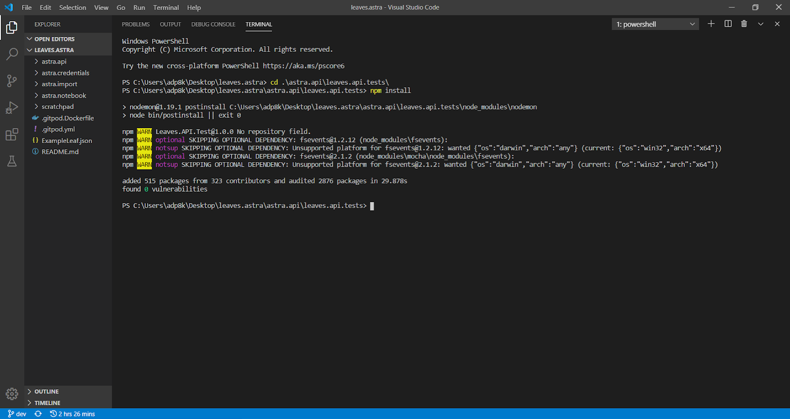
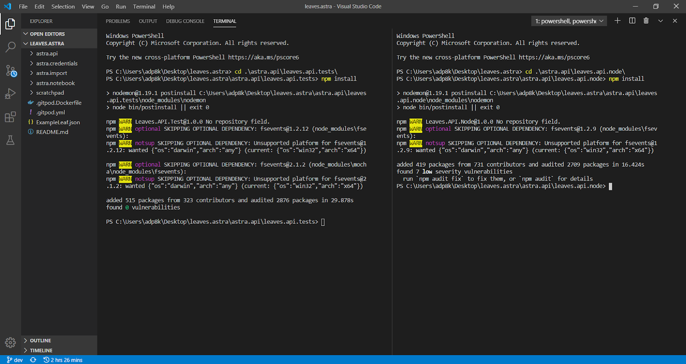
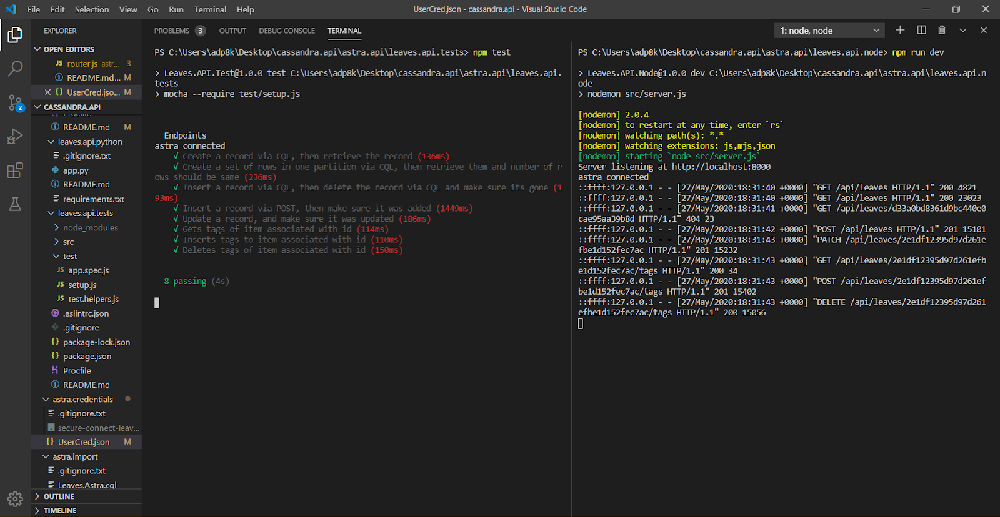
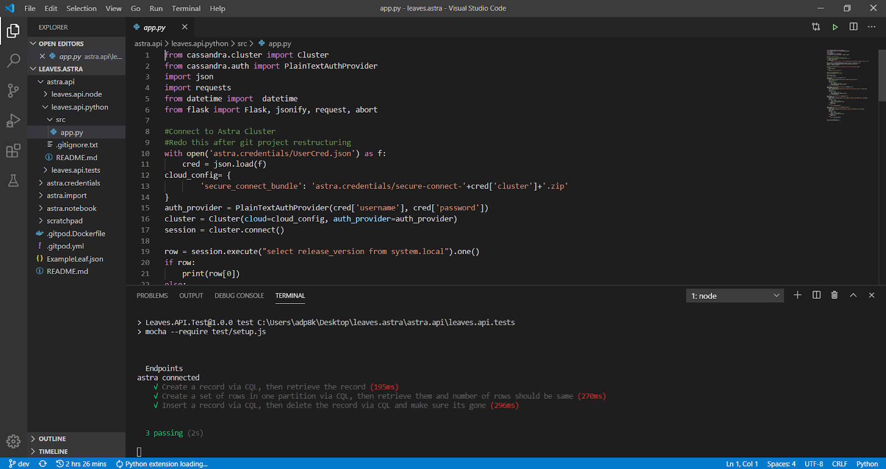
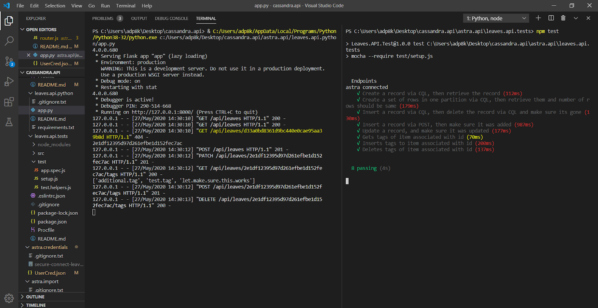
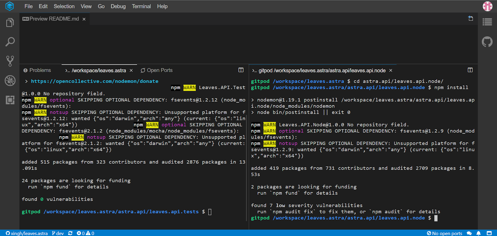
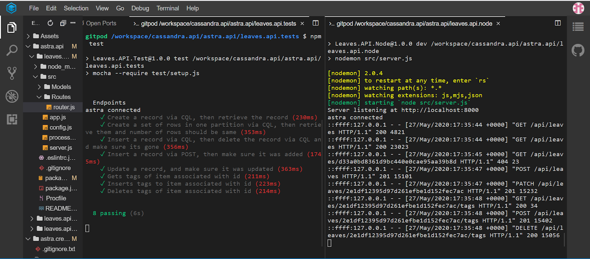
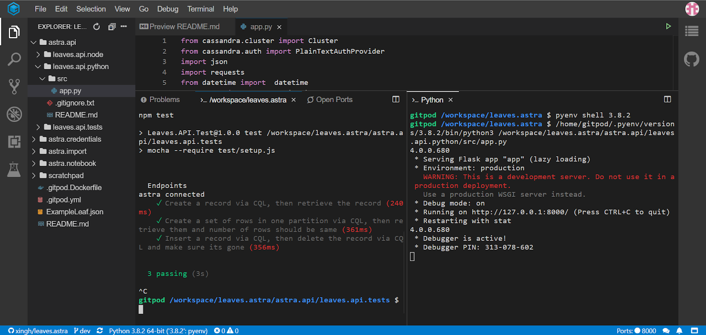
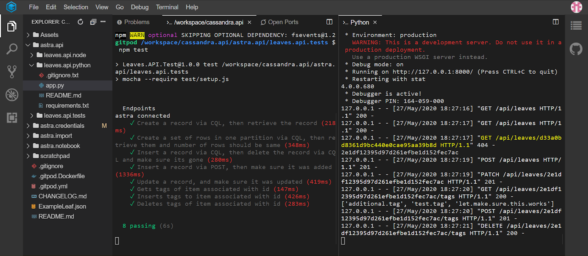

# Leaves.API.Test

Test Connectivity To Astra Locally & on [Gitpod](https://gitpod.io/)


## Getting Started

**2.4.1** `cd cassandra.api/astra.api/leaves.api.tests`

**2.4.2**
```
npm install 
npm run test
```

### Tests

* Create a record via CQL, then retrieve the record
* Create a set of rows in one partition via CQL, then retrieve them and number of rows should be same
* Insert a record via CQL, then delete the record via CQL and make sure its gone
* Insert a record via POST, then make sure it was added
* Update a record via PATCH, and make sure it was updated
* Gets tags of item associated with id via GET
* Inserts tags to item associated with id via POST
* Deletes tags of item associated with id via DELETE
  
### Tech Stack
- [Mocha](https://mochajs.org/)
- [Chai](https://www.chaijs.com/api/bdd/)
- [supertest](https://github.com/visionmedia/supertest)
  
#### Troubleshooting

* **Ensure your Node/Python API is running before starting tests**

**2.4.3** We will discuss how to run the tests for testing the node API and the python API from the same test suite. We can either do this on Gitpod or locally, whichever you prefer as the steps will be the same after setting it up. If doing this on Gitpod, go to `gitpod.io#the-repo-url` and wait for it to finish loading. If doing it locally, git clone the repo to whichever location. Once cloned, cd into the directory and open the directory in whichever code editor you are using. We will discuss the how-to for both. But before doing so, we will need to download the secure connect bundle from Astra and place that into the `/astra.credentials` directory, and then insert the appropriate credentials into `/astra.credentials/UserCred.json` as those will be needed to run the API’s and tests. Also, we will need to run the importer to create the table in Astra if that has not been done already. Instructions for doing so are in `/astra.import/README.md`. 

---

## Running Unit Tests Locally

**2.4.4** Start by cd-ing into the directory as seen below:


We can then open the directory in whichever code editor you are using. Before beginning, take the secure connect bundle zip from Astra and insert it into `/astra.credentials`, and then insert the appropriate credentials into `/astra.credentials/UserCred.json` as we will need them to run the API’s and tests. We can then open a new terminal and essentially do the same as we did for Gitpod. First, run `cd /astra.api/leaves.api.tests/` and run `npm install` as below:



### Testing Node API

**2.4.5** After doing so, open a new terminal to the right, run `cd /astra.api/leaves.api.node`, and then `npm install` as seen below:



**2.4.6** Once the npm installs have been run for both, using the terminal on the right (leaves.api.node) run `npm start` or `npm run dev` as outlined prior:


**2.4.7** Once the server is running, use the terminal on the left (leaves.api.tests) and run `npm test` and the tests should pass as below:




As you can see, the node API runs and the tests pass locally.

### Testing Python API:

**2.4.8** Now moving onto python, we will first need to `ctrl + c` to stop the node server from running on the right terminal. After closing that terminal, we can then open `app.py` using the directory structure on the left in `/astra.api/leaves.api.python`:



**2.4.9** Now, since Gitpod already has the modules installed with the build, the API may not run if you do not have them locally. Refer to the README.md in `/astra.api/leaves.api.python` to see what needs to be installed. Once done, we can click the green play button in the top right corner to run the python API. If you cannot split the terminal to show both the python API and tests, you may need to kill the tests terminal, and then split the running python terminal. Once split, you can run `cd /astra.api/leaves.api.tests` to get back to the tests as seen below:


**2.4.10** Now that we have the python API running in the left terminal, and now that we are back in the tests directory in the right terminal, we can run `npm test` in the right terminal. As long as the credentials did not change, the tests should pass as below:



Now we have run both the node and python API’s locally, and verified that they both work with passing tests.

---

## Running Unit Tests on Gitpod

[](https://gitpod.io/#https://github.com/anant/cassandra.api.git)


**2.4.11** First, cd into `/astra.api/leaves.api.tests` and run `npm install`. Once npm install has run, you can either choose to run the node API or the python API first, but only one can be tested at a time because they both point to `localhost:8000`.

### Testing Node API

**2.4.12** Open a new terminal split to the right, run `cd /astra.api/leaves.api.node`, and run `npm install`. After install, your screen should look like this: 



**2.4.13** Then, on the right terminal (the leaves.api.node) run `npm start` or `npm run dev`. Npm run dev uses nodemon, as outlined in the package.json file, to automatically restart the server after detecting changes, i.e. any saves. Once running, you can click make public and close out the next popup. You should see this:


**2.4.14** Now that the node API is running, we can use the terminal on the left (leaves.api.tests) and run `npm test` to run the tests. You should see this:



If you inserted your credentials correctly, the tests should pass as above.

### Testing Python API

**2.4.15** Now to move onto testing the python API, we need to stop the node server with `ctrl + c` and then close out the terminal on the right.


**2.4.16** Once done, we can navigate to `/workspace/cassandra.api/astra.api/leaves.api.python/app.py` on the left hand side and open the file. You should see this:


**2.4.17** The nice thing about Gitpod is that the modules are already installed, so we do not need to run `pip install`. Now, we can click the green play button in the right hand corner to run the python API. It should open a new terminal and you can then split it to the right:



**2.4.18** Once the python API is running, we can re-run `npm test` on the left terminal, and if your credentials haven’t changed, the tests should pass: 



And there you have it, both the node and python API’s run and pass the tests with minimal setup on Gitpod.

## Built With

* [NodeJS](https://nodejs.org/en/) - Framework Used
* [CQLSH](https://docs.datastax.com/en/astra/aws/doc/dscloud/astra/dscloudConnectcqlshConsole.html) - Connecting to Astra databases using CQLSH

## Contributing

## Versioning

## Authors
* **Arpan Patel** - *Initial work*

See also the list of [contributors](https://github.com/your/project/contributors) who participated in this project.