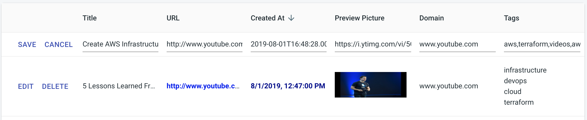
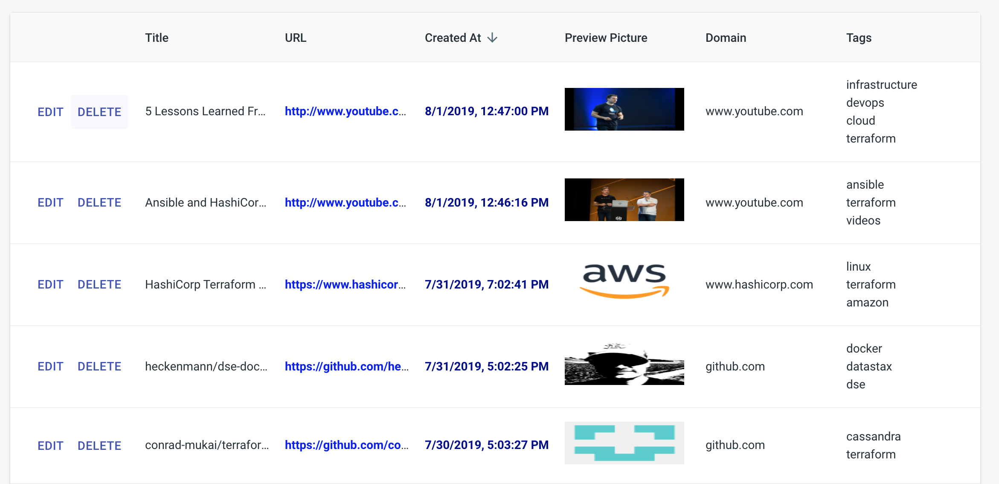

# Astra UI
---

Administration panel for <a href="https://github.com/Anant/cassandra.api">Cassandra.Api</a>


## Table of Contents
--- 
- [Setup](#setup)
  
- [# Astra UI](#h1-idastra-ui-136astra-uih1)
- [## Table of Contents](#h2-idtable-of-contents-136table-of-contentsh2)
- [Setup](#setup)
- [## Operations](#h2-idoperations-89operationsh2)
    - [Folder Structure](#folder-structure)
  

## Setup
1. Before you start the Administration panel, you'll need to run the Cassandra API:
```
https://github.com/Anant/cassandra.api/blob/master/README.md
```
2. In the base directory, add the following `.env`
<small>This will skip eslint pre-flight checks</small>

```
SKIP_PREFLIGHT_CHECK=true
```
3. Run `npm install` to install dependencies.
4. Navigate to http://localhost:3000


Each column allows sorting, editing, deletion and paginationm of our Cassandra table.

To edit columns, edit `/Views/Leaves/components/LeavesTable/LeavesTable.js`


## Operations
----


<br/>

- Edit


<br/>

- Delete updated article

<br/>

- Column sorting


#### Folder Structure
```
.
├── App.js
├── Routes.js
├── assets
│   └── scss
│       └── index.scss
├── components
│   ├── RouteWithLayout
│   │   ├── RouteWithLayout.js
│   │   └── index.js
│   └── index.js
├── index.js
├── layouts
│   ├── Main
│   │   ├── Main.js
│   │   ├── components
│   │   │   ├── Footer
│   │   │   │   ├── Footer.js
│   │   │   │   └── index.js
│   │   │   ├── Sidebar
│   │   │   │   ├── Sidebar.js
│   │   │   │   ├── components
│   │   │   │   │   ├── Profile
│   │   │   │   │   │   ├── Profile.js
│   │   │   │   │   │   └── index.js
│   │   │   │   │   ├── SidebarNav
│   │   │   │   │   │   ├── SidebarNav.js
│   │   │   │   │   │   └── index.js
│   │   │   │   │   └── index.js
│   │   │   │   └── index.js
│   │   │   ├── Topbar
│   │   │   │   ├── Topbar.js
│   │   │   │   └── index.js
│   │   │   └── index.js
│   │   └── index.js
│   ├── Minimal
│   │   ├── Minimal.js
│   │   ├── components
│   │   │   ├── Topbar
│   │   │   │   ├── Topbar.js
│   │   │   │   └── index.js
│   │   │   └── index.js
│   │   └── index.js
│   └── index.js
├── react-app-env.d.ts
├── serviceWorker.js
├── theme
│   ├── index.js
│   ├── overrides
│   │   ├── MuiButton.js
│   │   ├── MuiIconButton.js
│   │   ├── MuiPaper.js
│   │   ├── MuiTableCell.js
│   │   ├── MuiTableHead.js
│   │   ├── MuiTableRow.js
│   │   ├── MuiTypography.js
│   │   └── index.js
│   ├── palette.js
│   └── typography.js
└── views
    ├── Leaves
    │   ├── Leaves.js
    │   ├── components
    │   │   ├── LeavesTable
    │   │   │   ├── LeavesTable.js
    │   │   │   ├── gridStyles.css
    │   │   │   └── index.js
    │   │   └── index.js
    │   └── index.js
    ├── NotFound
    │   ├── NotFound.js
    │   └── index.js
    └── index.js
```
