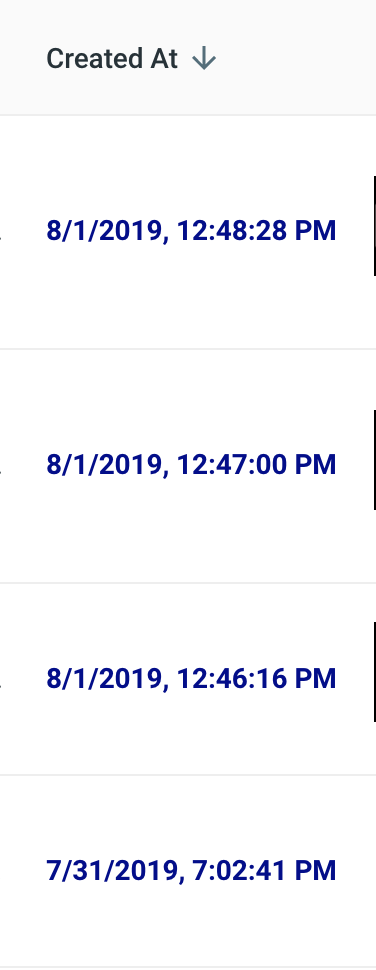

# Astra UI
---
These instructions will get your CRUD UI, using Astra, up and running.
Before you start the admin UI, you'll need to run the Cassandra.API code including the Data Migrator and the either of the provided APIs (node or python).

## Getting Started (Locally & on Gitpod)

### Setup

**2.5.1** In this directory, add an `.env` file with the following content:

```
SKIP_PREFLIGHT_CHECK=true
```
This will skip eslint pre-flight checks

**2.5.2** Next, run `npm install` to install dependencies.

**2.5.3** Finally, navigate to http://localhost:3000 to view your user interface.


### Operations

Each column allows sorting, editing, deletion and paginationm of our Cassandra table.


- Edit


- Delete


Column sorting




If you wish to edit naming conventions of the columns, edit `/Views/Leaves/components/LeavesTable/LeavesTable.js`


## Built With

* [UI Admin Kit](https://material-ui.com/store/items/devias-kit/) - Template Used

## Contributing

## Versioning

## Authors
* **Jordon Carter** - *Initial work*

See also the list of [contributors](https://github.com/your/project/contributors) who participated in this project.
